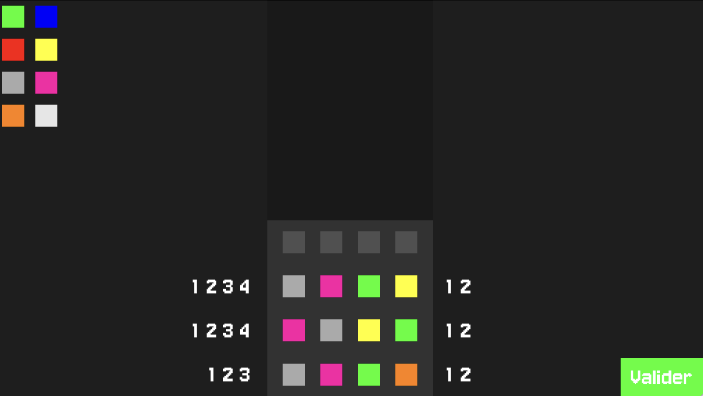

# Mastermind

## Développeuse

- [Sofia CETIN](https://code.up8.edu/scetin)

## Présentation du Mastermind

Le jeu du Mastermind est un jeu ayant pour but de trouver une combinaison de quatre couleurs. Le jeu se joue habituellement à deux joueurs avec l'un d'entre eux établissant la combinaison, et l'autre devant la deviner. 

Cependant, dans le cadre de ce projet, le jeu se joue à un joueur et la combinaison est générée aléatoirement par le programme. L'interface fonctionne via un style drag-and-drop: le joueur doit glisser une couleur dans une des positions de l'essai. Attention toutefois, un essai ne pourra être validé s'il comporte plusieurs fois la même couleur ou qu'une position n'est pas remplie.

Tout au long des manches, le joueur aura la possibilité de voir combien de couleurs sont correctes dans ses essais(à gauche), et combien de couleurs sont correctes et bien placées(à droite).

_Un aperçu du jeu_

## Installation

Des exécutables sont disponibles pour Windows, macOS et Linux dans la section Releases !
